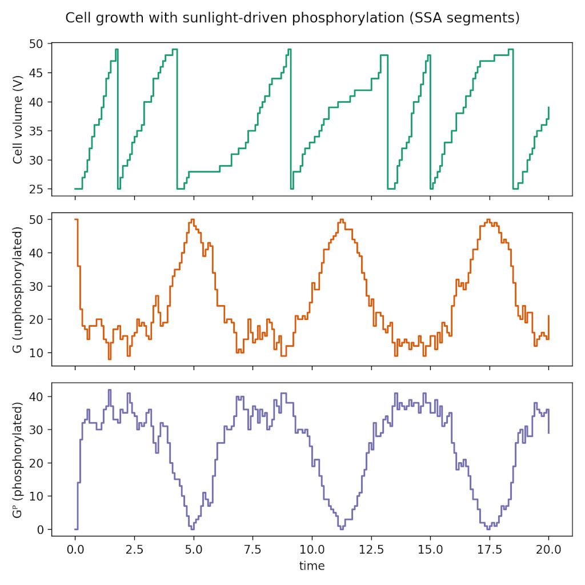
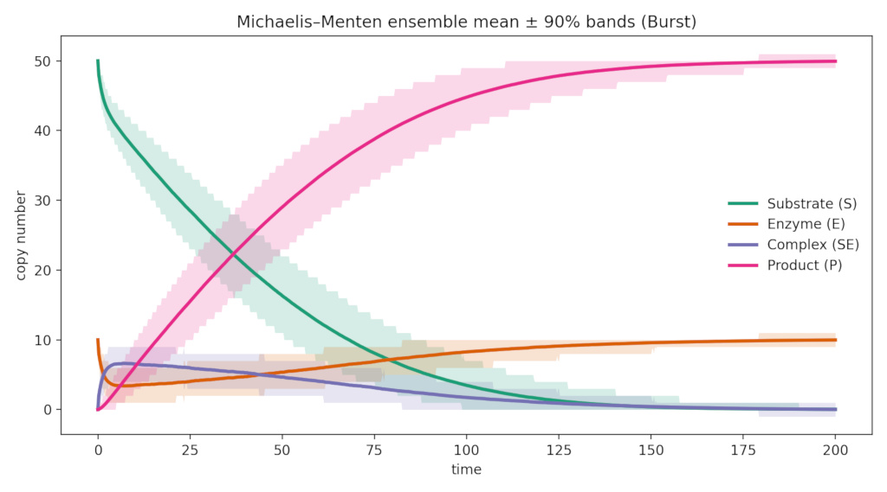
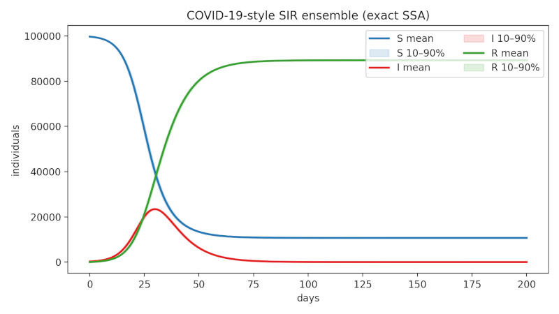
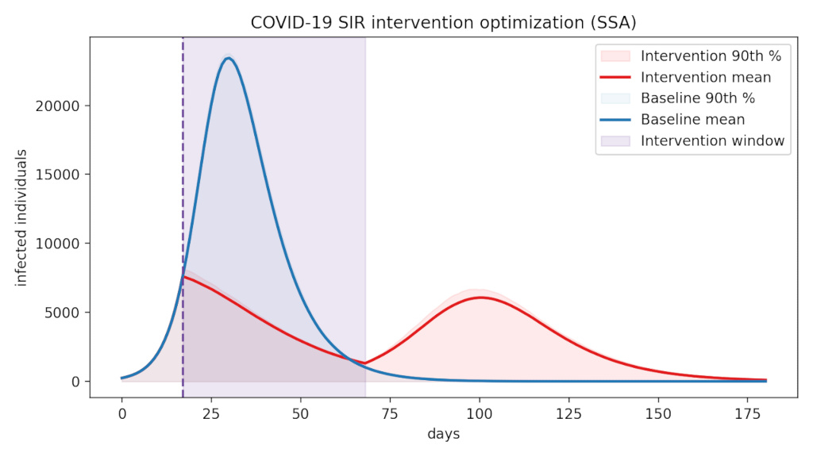

<div align="center">

<!-- Dark theme image -->


<!-- Light theme image -->


*A blazing-fast parallel Python engine to simulate reaction networks, written in Rust*

</div>

**Reactors** is an embarrassingly parallel and lightweight (only [1 single file](src/lib.rs) <50 KB) jump-process simulator implementing the Gillespie's Stochastic Simulation Algorithm (SSA). It provides a NumPy-friendly Python API, executes ensembles in parallel without holding the GIL, and ships as a single, memory-safe compiled wheel via maturin/pyo3. Unlike broader reaction-network toolchains with large symbolic or ODE stacks, **Reactors** stays minimal and efficient.

The library is designed for rapid experimentation and for generating ground-truth datasets used to benchmark network-inference or causal-discovery methods. It can simulate stochastic gene-regulatory circuits, signaling cascades, biochemical reaction networks, and simple intervention or control scenarios in epidemiological or biochemical systems, providing varied data sources for benchmarking.

> [!CAUTION]
> This lib is an experiment. Best suited for quick research or learning projects, expect rough edges and avoid production deployments.

### Example

```python
import numpy as np
import reactors

# Gene expression: G* → G* + mRNA, mRNA → ∅
stoich = np.array([[1, 0], [0, -1]], dtype=np.int32)
initial = np.array([0, 0], dtype=np.int32)
rates = np.array([20.0, 1.0])  # transcription, degradation
types = np.array([0, 0], dtype=np.int32)  # mass-action

# Simulate 10,000 cells in parallel
results = reactors.simulate_ensemble(
    stoich, initial, rates, types,
    t_end=50.0, n_trajectories=10000,
    t_points=np.linspace(0, 50, 200)
)
# results.shape: (10000, 200, 2) - 10k cells, 200 timepoints, 2 species
```

### Core Features

- 🧬 **Ensemble-ready:** Parallel trajectories with reproducible per-trajectory seeds.
- ⏱️ **Native interventions:** Schedule species or rate edits and the SSA loop automatically fires them at the right event boundaries.
- 🧪 **Rich kinetics:** Mass-action, Hill, Michaelis–Menten, plus custom expression-based rate laws.
- 📊 **Structured output:** Configurable timepoint recording tightly coupled with intervention timing.
- ⚡ **Dependency-aware updates:** Efficient recomputation of propensities so large sparse networks stay fast.
- 🛡️ **Robust core:** Type-safe model setup, defensive numeric checks, and hot loops kept lean for native performance.


## Running examples with pixi

This repo ships a [`pixi.toml`](pixi.toml) workspace so you can run any example script without hand-curating Python environments. Pixi installs Python 3.12 (our default dev interpreter) plus tooling such as maturin, numpy, SciPy, and matplotlib (the plotting dependency lives here instead of the wheel).

1. Install pixi by following [pixi.sh/install](https://pixi.sh/latest/#installation) (one-time per machine).
2. Inside the repo run `pixi install` to resolve the environment defined in `pixi.toml`.
3. Launch examples with `pixi run example-rna-splicing`, `pixi run example-covid-sir`, etc. The `pixi run …` commands wrap every script so it automatically sees the pinned interpreter and dependencies.
4. The `pixi run examples-all` task executes every Python-only demo in sequence while skipping long-running performance benchmarks. Add `-- --include-performance` for the benchmarking scripts.
5. Use `pixi run native-develop` to invoke  `maturin develop --release` with `target-cpu=native` flags so the extension is optimized for your cpu while keeping CI builds portable. For maximum optimization (Thin/Fat LTO, codegen-units=1), run `pixi run maturin-develop --profile dist-release` to install the fat-LTO build defined in `Cargo.toml`.

You can also build the extension in-place with `pixi run maturin-develop`, which keeps dev and demo workflows in the exact same environment.

## Some Examples

### 1. Light-Driven Cell Growth

**Description:** This demo mirrors [Catalyst.jl’s](https://github.com/SciML/Catalyst.jl) “cell volume growth with sunlight drive” example, but runs it with exact SSA segments inside Reactors. The growth factor `G` only promotes volume increase while phosphorylated (`Gᴾ`), sunlight drives the phosphorylation rate via `kₚ (sin(t) + 1) / V`, and whenever the cell volume reaches `Vₘ` (50) we deterministically divide by two. By recomputing propensities every `dt` chunk we reproduce the same dynamics Catalyst models via SDEs; the default script keeps all reactions mass-action, with an optional `--use-michaelis-menten` flag that turns the growth reaction into a saturating Michaelis–Menten step.

**Concrete example:**
```python
import math
import numpy as np
import reactors

stoich = np.array([
    [0, -1, 1],   # G -> Gp
    [0, 1, -1],   # Gp -> G
    [1, 1, -1],   # growth: Gp -> G + V
], dtype=np.int32)
reaction_type_codes = np.array([
    reactors.ReactionType.MASS_ACTION,
    reactors.ReactionType.MASS_ACTION,
    reactors.ReactionType.MASS_ACTION,
])
reaction_type_params = None  # set when --use-michaelis-menten is supplied
k_p, k_i, g_growth = 100.0, 60.0, 0.3

state = np.array([25, 50, 0], dtype=np.int32)  # [V, G, Gᴾ]
t = 0.0
history = [state.copy()]
while t < 20.0:
    volume = max(state[0], 1)
    sunlight = k_p * (math.sin(t + 0.05) + 1.0) / volume
    dephos = k_i / volume
    rates = np.array([sunlight, dephos, g_growth], dtype=np.float64)
    final = reactors.simulate_ensemble(
        stoich=stoich,
        initial_state=state,
        rate_constants=rates,
        reaction_type_codes=reaction_type_codes,
        reaction_type_params=reaction_type_params,
        t_end=0.1,
        n_trajectories=1,
        mode="final",
    )
    state = final[0].astype(np.int32)
    if state[0] >= 50:
        state[0] //= 2  # deterministic division checkpoint
    history.append(state.copy())
    t += 0.1
```

**How to run it:** `examples/cell_growth.py` draws the piecewise-SSA trajectories (pass `--use-michaelis-menten` to enable saturating growth) and saves `examples/output/cell_growth_timeseries.png`:

```bash
pixi run example-cell-growth
```

<p align="center">
  
</p>

### 2. Michaelis–Menten Deterministic Approximation

**Description:** This mirrors the Catalyst.jl example for deterministic Michaelis–Menten enzyme kinetics. The underlying reaction network is S + E ⇄ SE → P + E with rate constants (kᵦ, kᴅ, kᴘ) = (0.01, 0.1, 0.1), initial counts S₀=50, E₀=10, SE₀=P₀=0, and a simulation window of 0–200 time units. Instead of solving an ODE, Reactors fires a 4,096-trajectory SSA ensemble and plots the mean plus 90% bands for all species.

**How to run it:** `examples/michaelis_menten_deterministic.py` saves `examples/output/michaelis_menten_deterministic.png` after plotting all species together.

```bash
pixi run example-michaelis-menten
```

<p align="center">
  
</p>


### 3. COVID-19 Outbreak Modeling

**Description:** Stochastic epidemic curves for COVID-19-style SIR dynamics call for ensembles that capture peak timing, uncertainty bands, and intervention scenarios without reverting to deterministic ODE solvers. This example shows how Reactors keeps exact infection and recovery event timing while allowing textbook propensities such as β SI / N through expression reactions.

**Code:**
```python
population = 100_000
initial_state = np.array([population - 250, 250, 0], dtype=np.int32)
gamma = 1.0 / 7.0  # 7-day infectious period
r0 = 2.5
beta = r0 * gamma
infection_prefactor = beta / population

stoich_sir = np.array([
    [-1, 1, 0],  # infection: S + I -> 2I (ΔS=-1, ΔI=+1)
    [0, -1, 1],  # recovery: I -> R
], dtype=np.int32)

reaction_types = np.array([reactors.ReactionType.EXPRESSION, reactors.ReactionType.MASS_ACTION])
reaction_expressions = [f"{infection_prefactor:.12e} * s0 * s1", None]
rate_constants = np.array([0.0, gamma])

trajectories = reactors.simulate_ensemble(
    stoich=stoich_sir,
    initial_state=initial_state,
    rate_constants=rate_constants,
    reaction_type_codes=reaction_types,
    reaction_expressions=reaction_expressions,
    t_end=200.0,
    n_trajectories=2048,
    t_points=np.linspace(0.0, 200.0, 401),
)
```

**How to run it:** `examples/covid_sir.py` plots the mean and 10–90% percentile bands for S, I, and R
across 2,048 trajectories:

```bash
pixi run example-covid-sir
```

The script saves `examples/output/covid_sir_timeseries.png` so you can compare multiple scenarios side by side.

<p align="center">
  
</p>


It is also easy to connect the lib with optimizers or samplers to find optimal parameters. The `examples/covid_intervention_optimizer.py` script feeds a dual-annealing search into `simulate_ensemble`, reusing a shared pre-intervention ensemble via `initial_states`/`initial_times` and injecting `rate_set` interventions to model contact reduction. The objective minimizes the 90th-percentile peak infected count across thousands of trajectories, highlighting how the resume API avoids rerunning the stochastic prelude for every candidate.

```bash
pixi run example-covid-intervention
```
The optimizer example above relies on the new intervention scheduler (details below) and the per-trajectory resume API (`initial_states`/`initial_times`), so each candidate reuses the shared pre-intervention ensemble instead of rerunning the entire history.

<p align="center">
  
</p>

#### Configuring Interventions

Any call to `simulate_ensemble` can include an `interventions` keyword with a list of dictionaries. Each dictionary must be sorted by `time` and can include one or more of the following optional keys:

- `species_delta`: list of `(species_index, delta)` integer pairs to add or subtract counts.
- `species_set`: list of `(species_index, value)` pairs to assign absolute counts.
- `rate_set`: list of `(reaction_index, value)` floats to replace reaction rate constants.

All referenced indices must exist and entries fire as soon as `current_time >= time` (multiple events can share the same timestamp). Below is a simple “pulse” that doubles species `0` and halves reaction `3` at `t=12.5`, then restores the rate at `t=24.0`:

```python
results = reactors.simulate_ensemble(
    stoich,
    initial_state,
    rate_constants,
    reaction_type_codes,
    t_end=50.0,
    n_trajectories=4096,
    interventions=[
        {"time": 12.5, "species_delta": [(0, +50)], "rate_set": [(3, 0.5 * rate_constants[3])]},
        {"time": 24.0, "rate_set": [(3, rate_constants[3])]},
    ],
)
```

During execution Reactors re-evaluates propensities immediately after an intervention, so downstream reactions “see” the new state before the next stochastic jump is sampled. You can combine `species_delta` and `species_set` within the same event to clamp after applying a delta, or use `rate_set` on expression reactions to toggle whole modules on/off.

#### Resuming From Saved Trajectories

You can resume large ensembles without dropping to a Python loop by supplying a per-trajectory matrix of starting states and optional start times. Pass `initial_states` shaped `(n_trajectories, n_species)` and, if you want to keep absolute clocks, an `initial_times` vector of length `n_trajectories`. Reactors slices the right row and starts each trajectory at the specified time, skipping already-fired interventions or `t_points`:

```python
prelude = reactors.simulate_ensemble(
    stoich, shared_initial, rates, types,
    t_end=25.0, n_trajectories=1024,
    t_points=None, mode="final",
)

resume = reactors.simulate_ensemble(
    stoich=stoich,
    initial_state=shared_initial,
    initial_states=prelude,  # shape (1024, n_species)
    initial_times=np.full(prelude.shape[0], 25.0),
    rate_constants=rates,
    reaction_type_codes=types,
    t_end=50.0,
    n_trajectories=prelude.shape[0],
    interventions=[{"time": 10.0, "rate_set": [(2, 0.2)]}],
    mode="timeseries",
    t_points=np.linspace(0.0, 25.0, 100),
)
```

Each trajectory keeps its deterministic RNG stream (`seed` + trajectory index) so these resumptions behave exactly like a single long simulation, but you can branch, apply new interventions, or collect denser outputs without serial loops. If you omit `initial_times`, every trajectory restarts at `t=0` (treating `t_points` as relative to the new phase).


## Building and developing

### Installing via pip

If you just want to use the library without cloning the repo, install directly from GitHub with pip. This path builds from source, so make sure a Rust toolchain (e.g., via [rustup](https://rustup.rs)) and Python 3.10+ headers are present:

```bash
pip install "reactors @ git+https://github.com/pablormier/reactors.git"
```

Need the plotting dependencies for the demo scripts? Install the optional extras in the same command:

```bash
pip install "reactors[examples] @ git+https://github.com/pablormier/reactors.git"
```

If you prefer to skip the Rust toolchain requirement, download a wheel from the [GitHub Releases](https://github.com/pablormier/reactors/releases) page (CI uploads macOS + manylinux wheels for every tagged release). Point pip at the wheel asset directly, e.g.:

```bash
pip install https://github.com/pablormier/reactors/releases/download/v0.1.0/reactors-0.1.0-cp310-abi3-macosx_11_0_arm64.whl
```

You can also run `maturin build` locally to produce your own `*.whl`.

### Automated wheel builds

The workflow in [`.github/workflows/release.yml`](.github/workflows/release.yml) builds manylinux (x86_64 + aarch64) and macOS (Intel + Apple Silicon) wheels via `maturin` and attaches them (plus the sdist) to the GitHub Release whenever a tag matching `v*.*.*` is pushed or the workflow is manually dispatched.

### Local development

This project targets Python 3.10+ and uses [maturin](https://github.com/PyO3/maturin) for packaging. To keep environments reproducible, prefer running Python tooling through [`pixi`](https://pixi.sh) or [`uv`](https://github.com/astral-sh/uv) if you need to add additional tools.

```bash
# Fast local dev install
pixi run maturin develop --release

# or, using uv directly
uv run maturin develop

# Fat-LTO build defined by [profile.dist-release]
pixi run maturin develop --profile dist-release
```

Once installed, the Python API can be used as:

```python
import numpy as np
import reactors

traj = reactors.simulate_ensemble(
    stoich=np.array([[-1, 1]], dtype=np.int32),
    initial_state=np.array([50, 0], dtype=np.int32),
    rate_constants=np.array([0.1]),
    reaction_type_codes=np.array([reactors.ReactionType.MASS_ACTION], dtype=np.int32),
    t_end=10.0,
    n_trajectories=128,
    t_points=np.linspace(0.0, 10.0, 100),
    seed=42,
)
print(traj.shape)  # (128, 100, 2)
```

`reaction_type_codes` is an `int32` array whose length matches `n_reactions`. For readability you can fill
it with `reactors.ReactionType` enum members:

- `reactors.ReactionType.MASS_ACTION` - general mass-action kinetics. The reaction order is deduced entirely
  from the stoichiometry row (any number of reactants and stoichiometric coefficients is allowed).
- `reactors.ReactionType.HILL` - Hill-style propensities, which require `reaction_type_params` rows of the form
  `[activator_index, hill_n, k_half]`.
- `reactors.ReactionType.MICHAELIS_MENTEN` - enzyme-like Michaelis-Menten propensities that use the reaction's
  `rate_constant` slot as `V_max` and require `reaction_type_params` rows `[substrate_index, k_m]`.
- `reactors.ReactionType.EXPRESSION` - fully custom propensities defined by math expressions. Provide a parallel
  `reaction_expressions` sequence of strings (length = `n_reactions`) where each string references species as
  `s0`, `s1`, etc. (indexing by stoichiometry order). The string is evaluated with
  [`meval`](https://crates.io/crates/meval), so you can use functions like `sin`, `exp`, `pow`, etc. Rows that
  are `None`/`np.nan`/`""` should be set to `None` to skip expression evaluation for that reaction.

All other codes are reserved for future propensity families, so you can simply fill the array with
`ReactionType.MASS_ACTION` unless a reaction needs Hill activation or Michaelis–Menten saturation.

For example, to model a single Michaelis–Menten conversion `S -> P` you might write:

```python
reaction_type_codes = np.array([reactors.ReactionType.MICHAELIS_MENTEN], dtype=np.int32)
reaction_type_params = np.array([[0, 25.0]], dtype=np.float64)  # substrate species 0, K_m = 25 molecules
```

To by hand define a propensity `0.2 * s0 / (1.0 + s1)` you can instead use:

```python
reaction_type_codes = np.array([reactors.ReactionType.EXPRESSION], dtype=np.int32)
reaction_expressions = ["0.2 * s0 / (1.0 + s1)"]

traj = reactors.simulate_ensemble(
    stoich=stoich,
    initial_state=initial_state,
    rate_constants=rate_constants,
    reaction_type_codes=reaction_type_codes,
    reaction_expressions=reaction_expressions,
    # ... other args ...
)
```
Each `sN` identifier maps to species `N` in the stoichiometry row, so `s0` targets the first species, `s1` the second, and so on.

## Related software

Reactors intentionally stays tiny to keep Python SSA prototyping lightweight; if you need expressive modeling DSLs, SBML import, efficient ODE/SDE integrators for fast deterministic or stochastic approximations, or Boolean simulators that scale to very large signaling networks, consider these more mature tools:

- [Catalyst.jl](https://catalyst.sciml.ai/) *(Julia)* – ModelingToolkit-based symbolic workflows with SSA, tau-leap, diffusion approximations, and seamless handoff to DifferentialEquations.jl solvers plus parameter estimation tooling.
- [COPASI](https://copasi.org/) *(C++/GUI, bindings)* – Comprehensive biochemical network suite with SSA, hybrid deterministic-stochastic methods, steady-state analysis, and optimization, available via GUI and scripting bindings.
- [BioNetGen](https://bionetgen.org/) *(C++/Python front-ends)* – Rule-based modeling and SSA/tau-leaping simulators for combinatorial networks, bundled with NFsim for network-free simulations.
- [PySB + GillesPy2](https://pysb.org/) *(Python)* – Pythonic model definition layer (PySB) that can target GillesPy2 for GPU/CPU SSA, tau-leaping, and hybrid solvers, with SBML interoperability and tight integration into scientific Python stacks.
- [CellNOpt](https://saezlab.github.io/CellNOptR/) *(R/Python)* – Logic-based (Boolean and fuzzy) modeling and training of large signaling networks from perturbation/proteomics data, with optimization backends to fit logical rules to experimental readouts.
- [MaBoSS](https://maboss.curie.fr/) *(C++/CLI, WebMaBoSS UI)* – Specialized engine for continuous-time asynchronous Boolean networks, interpreting node flip rules as CTMC transitions and simulating them with Gillespie/Kinetic Monte Carlo (as in Stoll et al., BMC Systems Biology 2012).

## Limitations & Future Work

Reactors is intentionally small and experimental. Current gaps include:

- **Global observation grid:** all trajectories still share the same `t_points` slice and intervention schedule; truly per-trajectory sampling would require a different recorder API.
- **Mid-run reproducibility:** resuming ensembles derives seeds from `(seed, traj_idx)` rather than capturing RNG states mid-flight, so bit-identical continuation is not guaranteed.
- **Kinetics surface area:** only mass-action, Hill, Michaelis–Menten, and expression propensities exist. Delayed reactions, Michaelis–Menten inhibition variants, tau-leaping, or hybrid solvers are out of scope.
- **Expression performance:** user expressions run through the meval interpreter every propensity evaluation; compiling them into closures or bytecode would cut overhead.
- **Observability:** there is no built-in tracing, profiling, or progress reporting—long jobs remain silent unless you add Python-side hooks.
- **Single-node parallelism:** Rayon handles one host worth of threads; there is no distributed or GPU backend.

Future work could tackle per-trajectory readouts, expose RNG checkpointing, add compiled expression propensities or alias-table samplers, and surface richer diagnostics while keeping the core lightweight.

## Disclaimer

This library was written in Rust by GPT-5.2-Codex and Gemini 3 Pro.

## License

BSD 3-Clause; see [LICENSE](LICENSE).
